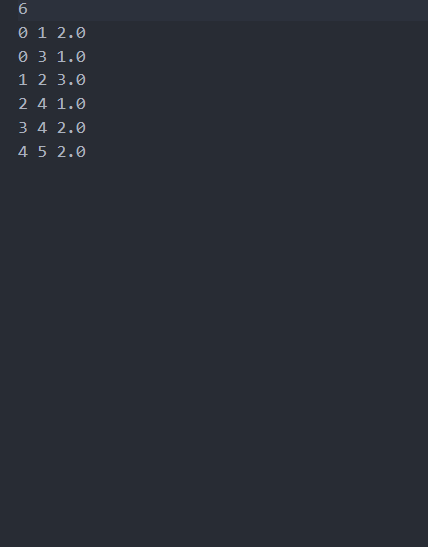

# Routing-Distances
## Command to Use(Terminal):
```(windows/pwsh) python routing_distances.py (textfilename.txt)```

```(linux/unix) python3 routing_distances.py (textfilename.txt)```

## Example of textfile:


## Design Thoughts
My design thoughts for this project really came down to me breaking into 4 main steps.
### Steps
1. I needed a way to read an input file into the program, so I used argparse as well as pythons native tooling
to read a txt file and process it into the parts i need for the algorithms.
2. Next I needed to Build the network topology. I used a list to represent the graph where each node has connections
with the respective cost
3. I needed to implement the Distance-Vector, Dihjstra's, and the Path-Vector algorithms. I did this by making each
their own seperate function and calling them when needed in order to make the program more readable.
4. Finally I needed to measure the time taken for each algorithm, I included the time python module in order to do this
I then timed each algorithm and printed their results out to the console.

## Complexity
As far as complexity my implementation is a fairly simplistic implementation for this project. I tried to
use only the things necessary to make this project function as intended by using a simplistic programming language,
with a lot of support and tooling.
The only real complexity there is with my implementation are with each algorithm which I've detailed below.

### Distance-Routing
Outer loop: It runs N−1N−1 times, where NN is the number of nodes. This is because Bellman-Ford tries to relax all edges up to N−1N−1 times to ensure the shortest path.
Inner loop: For every node, the algorithm checks all its edges, which can take O(E)O(E), where EE is the number of edges.

**The overall complexity is O(N x E)**
where N is the number of nodes and E is the number of edges.

### Dijkstra's Algorithm
Priority queue operations: Inserting and extracting the minimum element from the priority queue costs O(log⁡N)O(logN), where NN is the number of nodes.
Inner loop over edges: For each node, the algorithm checks all its edges (neighbors), which takes O(E)O(E) in total across all nodes.

**The overall complexity is O((N + E) log N)**
where N is the number of nodes and E is the number of edges.

### Path-Vector
Outer loop: Like Bellman-Ford, it runs N−1N−1 times to update paths.
Inner loop: For each node, it checks all edges, costing O(E)O(E).

**The overall complexity is O(N x E)**
this is the same as Distance-Routing but instead of only updating the cost. We also maintain the path.

### Overall Program Complexity
My overall program complexity is **O(N x E)**


